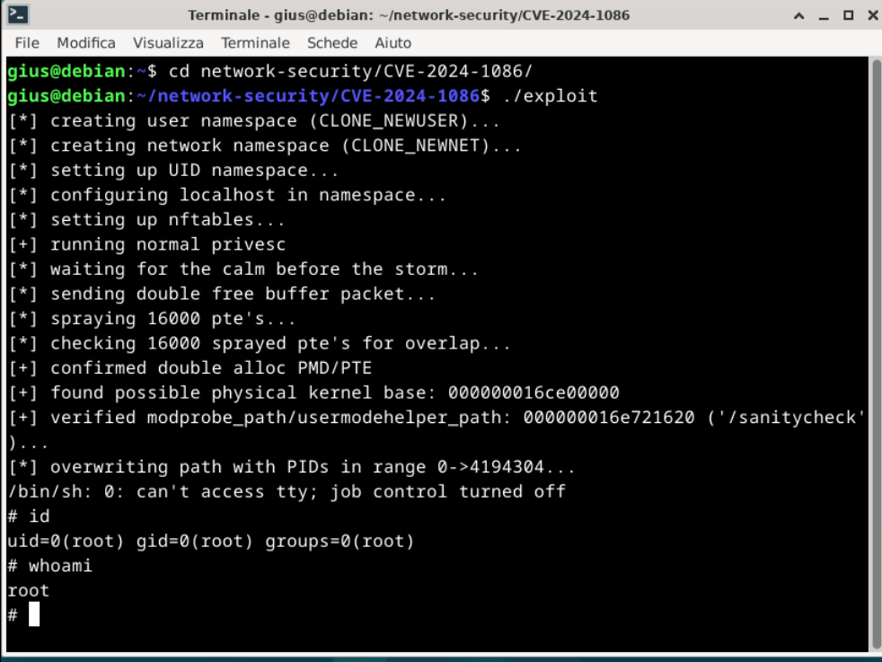

# Network security project

**DISCLAIMER**: this project is for study purpose. Main goal is to understand an advanced 
memory attack. I do not own the exploit PoC (
it is has been created by[this blogpost](https://pwning.tech/nftables)). 
I studied the vulnerability and exploit from the references provided in the [docs](./docs/refs.bib).

The project analyzes the dirty pagetable tecnique used to exploit the Linux Kernel. 

Based on [this blogpost](https://pwning.tech/nftables/) and related sources
I analyzed a nf_tables double free vulnerability that can be exploited using the dirty 
pagetables tecnique and modprobe_path overwriting to get root access from a machine.

## Execution
I compiled the kernel **6.4.16** with **CONFIG_ALLOC_INIT_ON=n** and **CONFIG_NF_TABLES=y**. 
I created a debian image and compiled the exploit using musl-gcc. 

